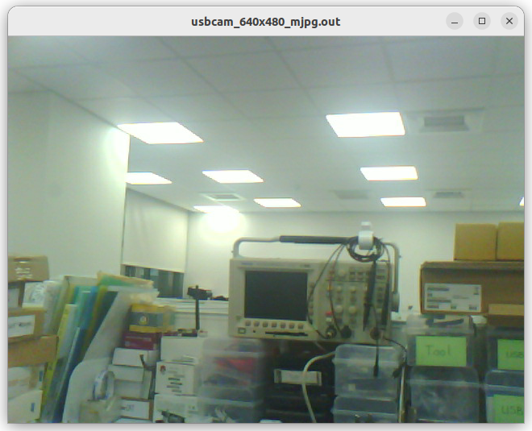

# gstreamer_in_c_on_ubuntu_22
control gstreamer with C on ubuntu 22

## If just want to run execution file
Ubuntu 22 comes with gstreamer, so run the file of .run directly.  

 
 

## if want to compile c file
sudo apt-get update   
sudo apt-get update \build-essential \  
libgstreamer1.0-dev \  
libgstreamer-plugins-base1.0-dev  
 
gcc play_videotest.c -o play_videotest.out \`pkg-config --cflags --libs gstreamer-1.0\`  
 
gcc usbcam_640x480_mjpg.c -o usbcam_640x480_mjpg.out \`pkg-config --cflags --libs gstreamer-1.0\`  
 
### If the document help you, how about buy street cats a fish can ? 
